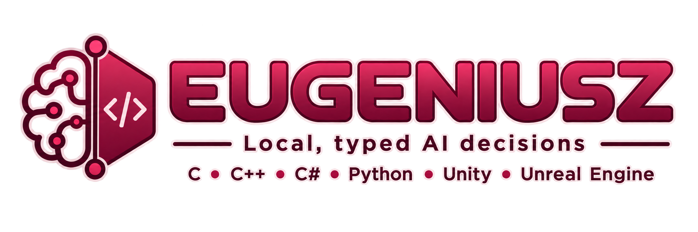
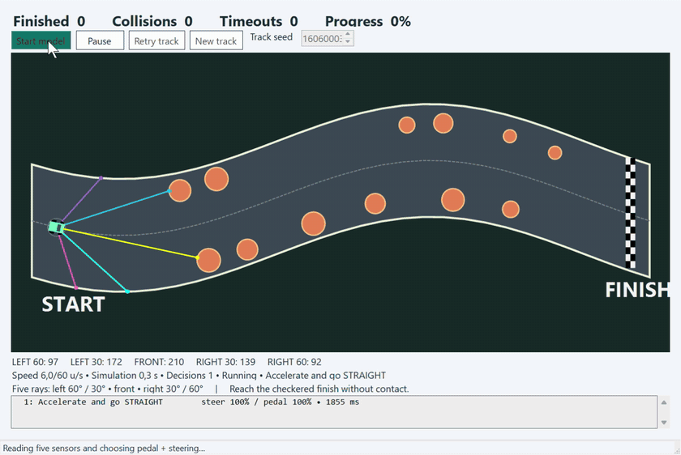
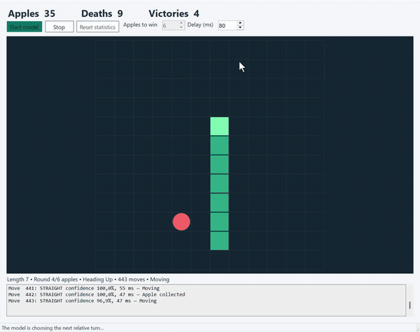
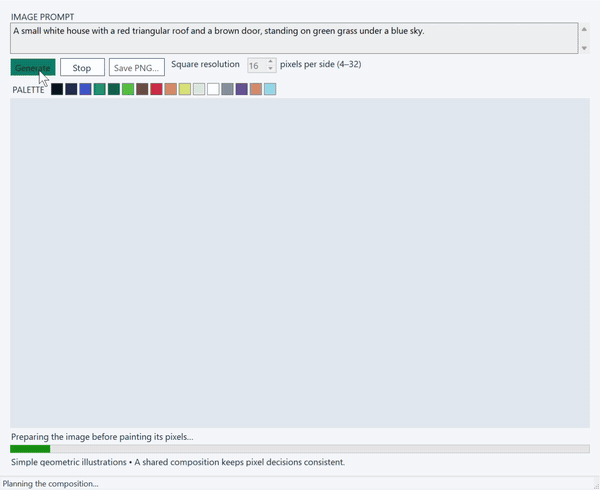

<p align="center">
  
</p>

<p align="center">
  <strong>Local AI. Typed answers. Inside your application.</strong><br>
  C · C++ · C# · Python · Unity · Unreal Engine
</p>

<p align="center">
  <a href="https://github.com/komorra/Eugeniusz/actions/workflows/ci.yml"></a>
  <a href="https://github.com/komorra/Eugeniusz/stargazers"></a>
  <a href="LICENSE"></a>
  <a href="#build"></a>
</p>

<p align="center">
  <a href="#demos">Demos</a> ·
  <a href="#build">Build</a> ·
  <a href="docs/api.md">API</a> ·
  <a href="docs/model-quality.md">Model quality</a> ·
  <a href="docs/integrations.md">Integrations</a> ·
  <a href="CONTRIBUTING.md">Contribute</a>
</p>

---

Eugeniusz is an MIT-licensed C++17 library with a versioned C ABI. It evaluates text
against a question and returns a choice, a rubric score, or a truth probability.
There is no server, API key, Python runtime requirement for native applications,
or generated JSON to parse. Inference stays inside your process.

| Choice | Score | Truth / Noul-style probability |
| --- | --- | --- |
| Select from your named options. | Evaluate against your ordered rubric. | Estimate a yes/no proposition. |
| Routing, actions, categories. | Severity, sentiment, quality levels. | Conditions, checks, flags. |

This is an independent, experimental alternative to the *decision interface* of
[Jev / TypeSafe AI](https://docs.typesafe.ai/introduction). It does not reproduce
Jev's proprietary architecture, RLCD training, latency or accuracy. General-purpose
Qwen models can be confidently wrong. See [research](docs/research.md) and
[calibration](docs/calibration.md) before relying on probabilities.

## Demos

Real recordings of the included [WinForms examples](examples/winforms/README.md),
running local models. Click an animation to open it at full size.

### Five sensors. One model-driven car.

The model reads five raycast distances and chooses steering and pedals while
navigating a winding track with circular obstacles. **Playback: 2×.**

<p align="center">
  <a href="docs/assets/demo-driving.gif"></a>
</p>

<table>
  <tr>
    <th width="50%">Snake: decisions in motion</th>
    <th width="50%">Pixel art: a prompt becomes a picture</th>
  </tr>
  <tr>
    <td valign="top"><a href="docs/assets/demo-snake.gif"></a></td>
    <td valign="top"><a href="docs/assets/demo-pixel-art.gif"></a></td>
  </tr>
  <tr>
    <td>The model chooses left, right, or straight. Apple, death, and victory counters track the run. <strong>Playback: 1×.</strong></td>
    <td>A shared scene plan keeps individual 16-color pixel choices consistent. <strong>Playback: 2.5×.</strong></td>
  </tr>
</table>

These recordings illustrate behavior, not a quality or latency benchmark. They
predate the latest model/prompt update; see the [current measurements](docs/model-quality.md).
The [demo guide](examples/winforms/README.md) includes a fourth app for trying
Choice, Score, and Truth with your own prompts.

### Eugeniusz in action — video demo

Watch another example of Eugeniusz in use. Click the preview to watch on YouTube.

<p align="center">
  <a href="https://www.youtube.com/watch?v=Y2bDkS4qMS4"></a>
</p>

## Three release profiles

| Profile | Pinned model | Weight size | Default context | Release backends |
| --- | --- | ---: | ---: | --- |
| **light / small** | Qwen3 0.6B Q8_0 | 639 MB | 2,048 tokens | CPU and GPU |
| **medium** | Qwen3 1.7B Q8_0 | 1,834 MB | 4,096 tokens | GPU |
| **large** | Qwen3 4B Instruct-2507 Q4_K_M | 2,497 MB | 4,096 tokens | GPU |

The same native ABI serves all three. A release bundle contains the library, the
selected model, bindings, examples, licenses and a `profile.json`. The canonical
small profile name is **light**; download, benchmark, and packaging commands also
accept **small** as an alias. Large is the capacity/quality-oriented profile;
better accuracy on every task is not guaranteed. Light prioritizes short-request
latency; "ultra fast" is a goal to measure, not a universal timing promise.

The [300-case API quality report](docs/model-quality.md) compares the old and new
profiles, candidate models, prompt formats, accuracy, score error, and GPU latency.
It includes 100 Choice, 100 Score, and 100 Truth (boolean) cases. Small remains weak
on numerical and logical reasoning; high model confidence is not proof of correctness.

GPU profiles target a single **RTX 4060 with 8 GB VRAM**, using Vulkan or CUDA on
Windows/Linux. macOS uses Metal on supported Apple hardware. Weights are only part
of memory use: allow for the context, compute buffers, driver and host application.
Only one profile/model needs to be resident. See [measured results and limits](docs/validation.md).

## Build

Requirements: a C++17 compiler and CMake 3.20+. Windows source builds use MSVC;
the pinned llama.cpp version has a known build problem with the local MinGW headers.
Use a Visual Studio developer terminal on Windows. No package manager is needed.

```sh
# Core only: no model/inference dependency and no network fetch.
cmake -S . -B build/core -DCMAKE_BUILD_TYPE=Release
cmake --build build/core --config Release --parallel
ctest --test-dir build/core -C Release --output-on-failure

# Native local CPU inference; fetches a hash-pinned llama.cpp source archive.
cmake -S . -B build/cpu -DCMAKE_BUILD_TYPE=Release -DEUGENIUSZ_LLAMA=ON
cmake --build build/cpu --config Release --parallel
cmake --install build/cpu --config Release --prefix build/install-cpu

# Fetch weights once using Python's standard library (not needed at runtime).
python scripts/download_model.py light
```

Run `build/cpu/bin/eugeniusz_decide models/downloads/Qwen3-0.6B-Q8_0.gguf`.
Visual Studio multi-configuration builds put executables under `bin/Release`;
Windows executables have `.exe` suffixes.

For a GPU source build, use a separate directory and add one of:

```sh
-DEUGENIUSZ_ACCELERATOR=VULKAN  # Vulkan SDK needed at build time; GPU driver at runtime
-DEUGENIUSZ_ACCELERATOR=CUDA    # CUDA toolkit needed at build time
-DEUGENIUSZ_ACCELERATOR=METAL   # macOS / Xcode command line tools
```

Pass `gpu_layers=99` to request full offload. The default is CPU; an unavailable
requested GPU produces an error. The backend uses the first enumerated GPU and
does not spread weights over multiple devices. On multi-GPU Vulkan hosts,
`GGML_VK_VISIBLE_DEVICES` can restrict the device selection before the first load.

Windows can also use the [pinned prebuilt Vulkan runtime](docs/building.md), avoiding
a GPU SDK installation. Core and adapter remain compiled from this repository.

## C++

```cpp
#include <eugeniusz/llama.hpp>

auto options = eg_llama_options_default();
options.context_size = 2048;
options.gpu_layers = 99; // Use 0 with the light CPU build.
auto engine = eugeniusz::load_model("models/Qwen3-0.6B-Q8_0.gguf", options);
auto answer = engine.choice(
    "I was charged twice for my subscription.",
    "Which team should handle this ticket?",
    {"Billing: payments and invoices", "Shipping: parcel delivery"},
    1.0, 0.8);
if (!answer.abstained) {
    // Route using answer.choice. Calibrate and validate the threshold first.
}
```

Link `Eugeniusz::llama` after `find_package(Eugeniusz CONFIG REQUIRED)`, or use
`add_subdirectory` with `EUGENIUSZ_LLAMA=ON`. Core-only consumers link
`Eugeniusz::eugeniusz`. [C ABI contract](docs/api.md).

## Python

```sh
python -m pip install ./bindings/python
```

```python
from eugeniusz import Runtime

runtime = Runtime("build/install-cpu")
with runtime.load_model("models/downloads/Qwen3-0.6B-Q8_0.gguf", context_size=2048) as model:
    result = model.truth("The parcel arrived yesterday.", "Has the parcel arrived?")
    print(result.value, result.probabilities)
```

The wrapper uses `ctypes` only. Set `EUGENIUSZ_LIBRARY_DIR` instead of passing a
directory if preferred. Keep all native dependency libraries together.

## .NET and game engines

The managed wrapper targets .NET Standard 2.1 and builds as `Eugeniusz.Managed.dll`
to avoid colliding with native `eugeniusz.dll` on Windows.

```csharp
using Eugeniusz;
var options = ModelOptions.Default;
options.GpuLayers = 99;
using var model = Engine.Load("models/Qwen3-0.6B-Q8_0.gguf", options);
var answer = model.Truth("The parcel arrived.", "Has the parcel arrived?");
Console.WriteLine(answer.Value);
```

Runnable [.NET example](examples/dotnet), [Unity 6.6 example](examples/unity), and
[Unreal Engine 5.8 Blueprint async plugin](examples/unreal) are included.
See [integration and packaging instructions](docs/integrations.md).

Four [Windows Forms applications](examples/winforms/README.md) are also included:
a Choice/Score/Truth playground, model-controlled Snake, a tiny 16-color image
generator, and a car that navigates a random 2D obstacle course using five raycasts.

```powershell
dotnet run --project examples/winforms/Decisions -c Release
dotnet run --project examples/winforms/Snake -c Release
dotnet run --project examples/winforms/PixelArt -c Release
dotnet run --project examples/winforms/Driving -c Release
```

Build/install a native runtime first. The Windows sample builds copy its DLLs to
their output directories automatically; manual PATH changes are unnecessary.
Select a GGUF file and CPU or GPU inside each application. See the linked guide for
model discovery, ready-to-run publishing, and limitations of the visual demos.

## What is implemented

- Choice and ordered score distributions over 2–26 criteria; truth over false/true.
- Dense Qwen2/Qwen3 and SmolLM2 ChatML GGUF inference through llama.cpp; one prompt prefill per question.
- Choice/Score/Truth use no generated answer tokens or output parser; an optional
  bounded text-completion API supports tasks such as planning a pixel-art scene.
- Isolated, sequential batches with atomic output and per-engine serialization.
- Temperature fitting, NLL/Brier/ECE/accuracy metrics and split conformal sets.
- C callbacks for plugging in another classifier or an optimized custom backend.
- Core/native tests, Python/.NET checks, three-platform CI and release bundle tooling.

There are no bundled trained calibration parameters, native multimodal inputs,
shared-state attention caching, RLCD replication or claimed semantic correctness
guarantees. The release profiles intentionally use tested Qwen3 dense chat models,
including Instruct-2507 for large and the drawing/driving demos. Other accepted
ChatML candidates are listed in the quality report; arbitrary GGUF compatibility
is not promised. Read the [architecture](docs/architecture.md).

## License and contributing

Original code: [MIT](LICENSE). Selected model weights: **Apache-2.0**, permitting
commercial use subject to their license conditions. Preserve model licenses and
notices; see [third-party notices](THIRD_PARTY_NOTICES.md).

[Contributing](CONTRIBUTING.md) · [Security](SECURITY.md) · [Changelog](CHANGELOG.md)
· [Release instructions](docs/releases.md). No hosted release or commit is created
by these files; publishing remains a maintainer action.

## Community and star history

If Eugeniusz is useful in your application, a GitHub star helps others discover it.
[Report a bug](https://github.com/komorra/Eugeniusz/issues) or explore the
[roadmap](docs/roadmap.md) and [contribution guide](CONTRIBUTING.md).

<a href="https://www.star-history.com/#komorra/Eugeniusz&amp;Date">
  <picture>
    <source media="(prefers-color-scheme: dark)" srcset="https://api.star-history.com/svg?repos=komorra/Eugeniusz&amp;type=Date&amp;theme=dark">
    <source media="(prefers-color-scheme: light)" srcset="https://api.star-history.com/svg?repos=komorra/Eugeniusz&amp;type=Date">
    
  </picture>
</a>

Live chart by [Star History](https://www.star-history.com/). Build status and star
counts are supplied by GitHub and the linked badge services.
